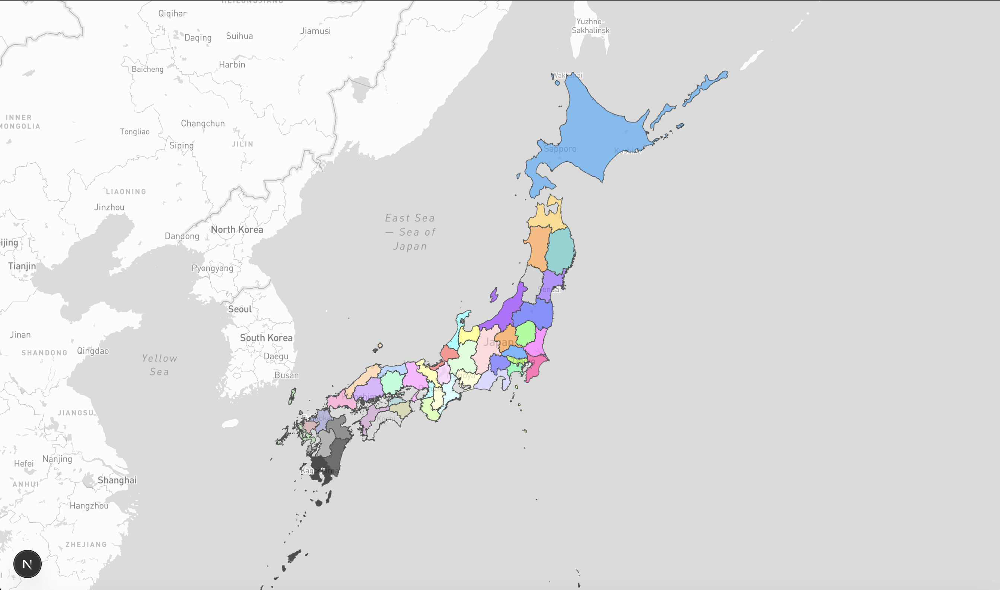

# DeckGLを使ったQZ1ビューア

このリポジトリは、DeckGLを使用してQZ1パケットの位置情報を地図上に表示するビューアのサンプルコードを提供します。



## インストール手順

1. Node.jsをインストールします。
[Node.js公式サイト](https://nodejs.org/)

2. ターミナルでプロジェクトディレクトリに移動し、依存関係をインストールします。

```bash
cd deckgl-packet-viewer
npm install
```

3. 環境変数を設定します。`.env`ファイルを作成し、以下の内容を追加します。

```bash
NEXT_PUBLIC_MAPBOX_TOKEN=あなたのMapboxAPIキー
```

4. 開発サーバーを起動します。

```bash
npm run dev
```

5. simple-dcr-emulatorと，ws-qzqsm-decoderを起動し，QZ1パケットを送信します。

```bash
cd simple-dcr-emulator
python3 main.py
```

```bash
cd ws-qzqsm-decoder
python3 main.py
```
